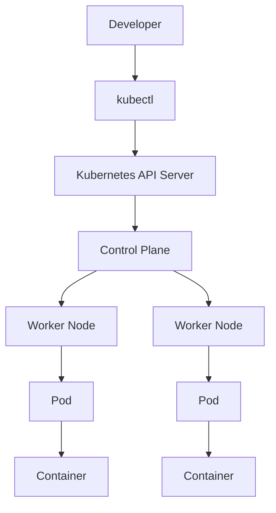

# ☸️ Day 1 – What is Kubernetes?

> **Learning Goal:** Understand Kubernetes, why it is needed, and how it works with containers.

---

## 🎯 What I Learned

Today I learned:

* What Kubernetes is
* Why Kubernetes is needed
* How Kubernetes works with containers
* Basic Kubernetes architecture
* Important Kubernetes terms
* How `kubectl` communicates with a Kubernetes cluster

---

## 🤔 Why Do We Need Kubernetes?

Docker helps us create and run containers.

But managing many containers manually becomes difficult when an application grows.

| Problem               | How Kubernetes Helps                   |
| --------------------- | -------------------------------------- |
| Many containers       | Manages workloads automatically        |
| Container failure     | Can restart failed workloads           |
| Increased traffic     | Supports scaling                       |
| Multiple machines     | Manages workloads across nodes         |
| Application updates   | Supports controlled updates            |
| Network communication | Provides service discovery             |
| Configuration         | Helps manage application configuration |

### Without Kubernetes

```text
Developer
    |
    v
Multiple Containers
    |
    v
Manual Management
```

### With Kubernetes

```text
Developer
    |
    v
Kubernetes
    |
    +------ Pod
    |
    +------ Pod
    |
    +------ Pod
```

---

## 🧠 Kubernetes in Simple Words

**Kubernetes is a container orchestration platform.**

In simple terms:

> Kubernetes helps us deploy, manage, scale, and maintain containerized applications.

For example, an application may have multiple containers running on different machines.

Instead of managing each container manually, Kubernetes provides a system to manage these workloads.

---

## 🐳 Docker vs Kubernetes

| Docker                             | Kubernetes                                    |
| ---------------------------------- | --------------------------------------------- |
| Creates and runs containers        | Manages containerized applications            |
| Mainly works with containers       | Manages workloads across containers and nodes |
| Useful for development and testing | Useful for managing applications at scale     |
| Provides container tooling         | Provides container orchestration              |

### Simple Relationship

```text
Docker
   |
   v
Container
   |
   v
Kubernetes
   |
   v
Manages Containerized Applications
```

---

## 🏗️ Basic Kubernetes Architecture



---

## 📚 Important Kubernetes Terms

| Term              | Simple Meaning                                     |
| ----------------- | -------------------------------------------------- |
| **Cluster**       | Complete Kubernetes environment                    |
| **Control Plane** | Manages the Kubernetes cluster                     |
| **Node**          | Machine where workloads run                        |
| **Pod**           | Smallest deployable unit in Kubernetes             |
| **Container**     | Runs the application                               |
| **kubectl**       | Command-line tool used to interact with Kubernetes |

---

## 📦 What is a Pod?

A **Pod** is the smallest deployable unit in Kubernetes.

A Pod usually contains one container, but it can also contain multiple closely related containers.

```text
Kubernetes
     |
     v
    Pod
     |
     v
 Container
     |
     v
 Application
```

For a beginner, remember:

> **Pod → Container → Application**

---

## 🖥️ What is a Node?

A **Node** is a machine that runs Kubernetes workloads.

A node can be:

* A physical machine
* A virtual machine
* A cloud instance

Example:

```text
Kubernetes Cluster
       |
       +----------------+
       |                |
       v                v
   Worker Node 1    Worker Node 2
       |                |
       v                v
      Pod              Pod
```

---

## 🎛️ What is the Control Plane?

The **Control Plane** manages the Kubernetes cluster.

It handles tasks such as:

* Managing the desired state
* Scheduling workloads
* Processing Kubernetes API requests
* Managing cluster resources

Simple view:

```text
              Control Plane
                    |
          +---------+---------+
          |         |         |
          v         v         v
       Worker    Worker    Worker
        Node      Node      Node
```

---

## 🔧 What is kubectl?

`kubectl` is the command-line tool used to communicate with Kubernetes.

Example:

```bash
kubectl get nodes
```

This asks Kubernetes:

> "Show me the nodes in this cluster."

Another example:

```bash
kubectl get pods
```

This asks Kubernetes:

> "Show me the Pods in the current environment."

---

## 🔄 Basic Kubernetes Workflow

```text
Developer
    |
    v
  kubectl
    |
    v
API Server
    |
    v
Kubernetes Cluster
    |
    v
Worker Node
    |
    v
   Pod
    |
    v
Container
    |
    v
Application
```

---

# 🔧 Hands-On Practice

## 1. Check kubectl

Run:

```bash
kubectl version --client
```

### Purpose

Checks whether `kubectl` is installed.

### Observe

Look for the client version information.

---

## 2. Check the Kubernetes Cluster

Run:

```bash
kubectl cluster-info
```

### Purpose

Checks whether `kubectl` can communicate with a Kubernetes cluster.

### Observe

You should see information about the Kubernetes control plane if a cluster is running.

> **Expected:** Your output may vary depending on your setup.

---

## 3. Check Kubernetes Nodes

Run:

```bash
kubectl get nodes
```

### Purpose

Displays the nodes available in your cluster.

### Example Structure

```text
NAME       STATUS   ROLES
node       Ready    control-plane
```

> Your node name, status, version, and other columns may be different.

---

## 🔍 What Happened Behind the Scenes?

When you run:

```bash
kubectl get nodes
```

The basic flow is:

```text
kubectl
   |
   v
API Server
   |
   v
Kubernetes Control Plane
   |
   v
Cluster Information
   |
   v
Terminal Output
```

`kubectl` communicates with the Kubernetes API server to request information from the cluster.

---

## 🌍 Real-World Example

Imagine an e-commerce application.

It may contain:

```text
E-Commerce Application
        |
        +---- Frontend
        |
        +---- Backend API
        |
        +---- Payment Service
        |
        +---- Order Service
        |
        +---- Background Jobs
```

As the application grows, manually managing these components becomes difficult.

Kubernetes can help manage these workloads across a cluster.

---

## ⚠️ Common Mistakes

### 1. kubectl is installed but no cluster is running

Installing `kubectl` does not automatically create a Kubernetes cluster.

### 2. Thinking Kubernetes and Docker are the same

Docker and Kubernetes solve different problems.

### 3. Copying commands without understanding them

Understand what each command does before running it.

### 4. Trying to learn everything on Day 1

Focus on the basic concepts first.

### 5. Assuming every Kubernetes setup is identical

Minikube, Kind, Docker Desktop, and cloud clusters can produce different outputs.

---

## 💡 Key Takeaways

* Kubernetes is a container orchestration platform.
* Kubernetes manages containerized applications.
* A Kubernetes environment is called a **cluster**.
* A cluster contains **nodes**.
* Applications run inside **Pods**.
* Pods contain containers.
* The **Control Plane** manages the cluster.
* `kubectl` is used to interact with Kubernetes.
* Kubernetes helps with deployment, scaling, recovery, and management.

---

# 🚀 Mini Challenge

### Task 1

Run:

```bash
kubectl version --client
```

Record your Kubernetes client version.

### Task 2

Run:

```bash
kubectl cluster-info
```

Check whether your cluster is reachable.

### Task 3

Run:

```bash
kubectl get nodes
```

Record:

* Node name
* Status
* Role
* Kubernetes version

### Bonus

Run:

```bash
kubectl --help
```

Explore some of the available commands.

---

# 📝 My Learning Notes

```text
Kubernetes setup:

Number of nodes:

Node status:

Kubernetes version:

What I understood:

What I practiced:

What I found difficult:
```

---


# 📚 Free Learning Resources

* [Kubernetes Official Documentation](https://kubernetes.io/docs/)
* [Kubernetes Concepts](https://kubernetes.io/docs/concepts/)
* [Kubernetes Basics](https://kubernetes.io/docs/tutorials/kubernetes-basics/)
* [Kubernetes Glossary](https://kubernetes.io/docs/reference/glossary/)
* [Minikube](https://minikube.sigs.k8s.io/)
* [Kind](https://kind.sigs.k8s.io/)

---

# 📌 GitHub Update

### Commit Message

```text
Day 1: Learned Kubernetes fundamentals and practiced basic cluster commands
```

### Learning Summary

```text
Day 1 completed.

Learned the basics of Kubernetes, Pods, Nodes,
Control Plane, clusters, and kubectl.

Practiced basic Kubernetes cluster commands
and understood how kubectl communicates with
the Kubernetes API.
```

---


